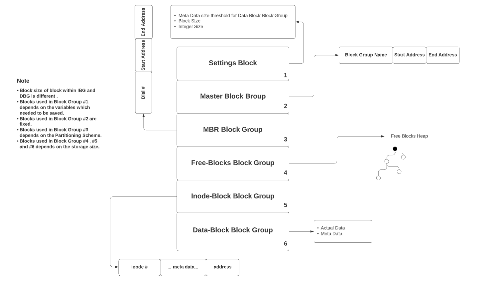
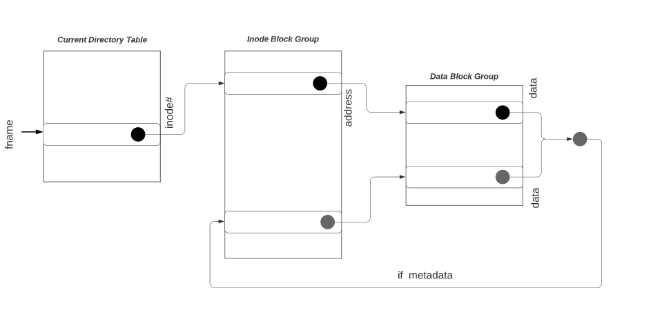
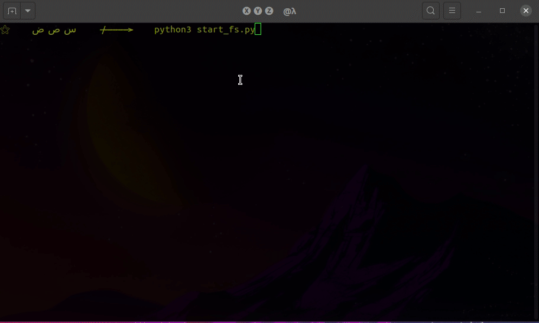
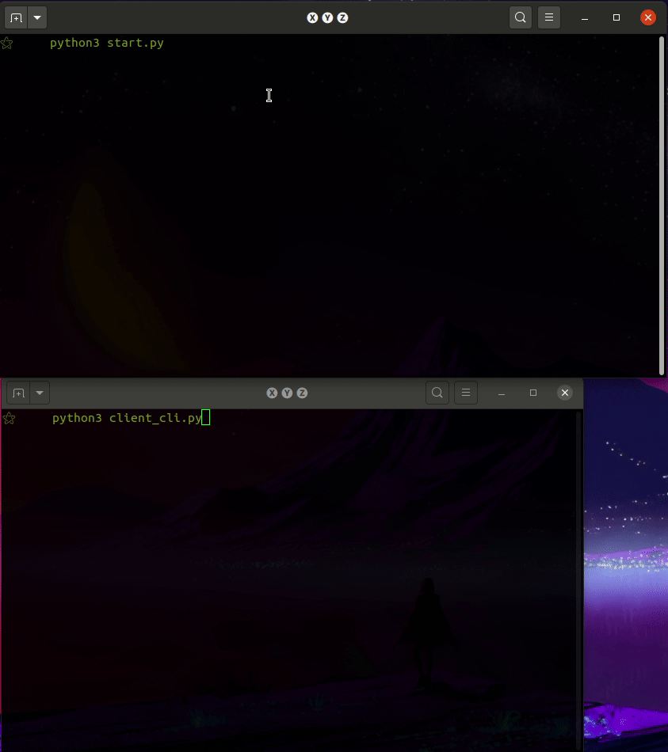
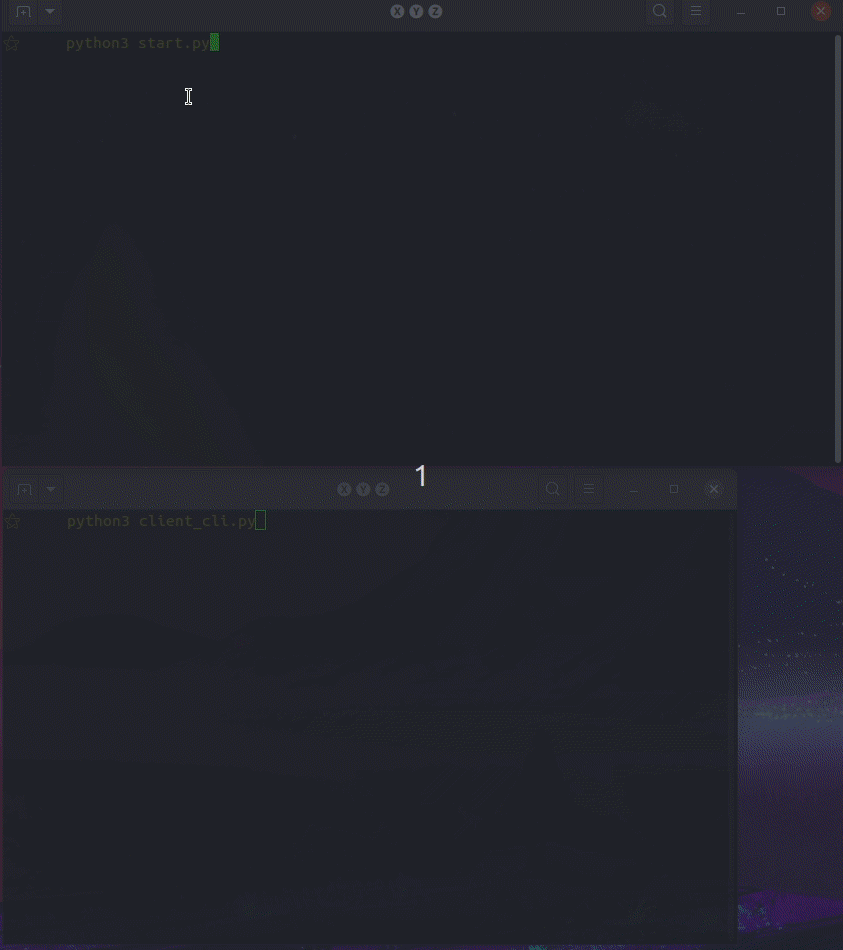
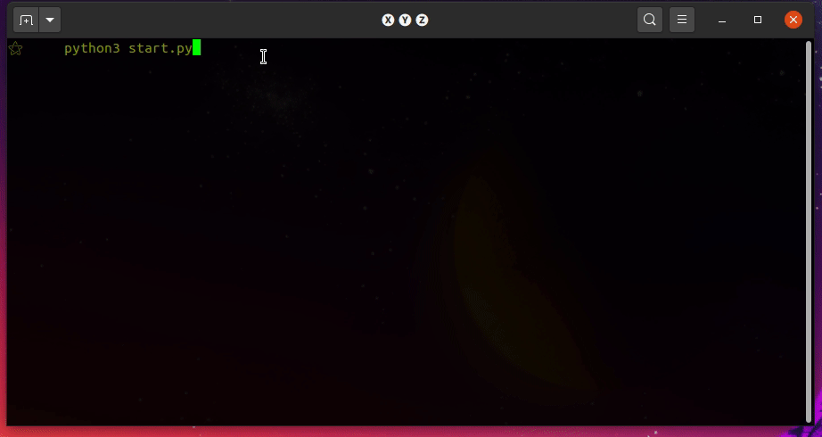

# ABOUT
This is an attempt to mimic low level memory constraints in dynamically typed python and then addressing some of the issues in the design of simple file system. Not tested!!
<br>
SOME PROMPT STUFF CAUSING ISSUE ON WINDOWS, works fine on linux. SERVER CAN CONNECT WITH MACHINES WITHIN SAME LAN.
# Modes
Runs in three modes:

| mode | description |
| ------ | ----- |
| root | only root user can use it as personal filesystem |
| server| Multiple users can have remote access to this filesystem |
| dual| admin or root user can be using this filesystem while it is also being as server for remote users |

> Access rights for each user can be managed by root (`code need slight addition for this to be functional`)<br>
> Each user can be in different directory simulatneously.<br>


# Desgin and Features

 It makes use of arrays and each `fixed size array is treated as one memory block` of hard disk, each block is of fixed siz,
total number of blocks are to be decided when you initialize this file system. It also tried to address problem of `HARD
LINKS` and `SOFT LINKS` and do a TRANSLATION from logical to physical address. A table of inodes is maintained. and..
`EVERYTHING IS A FILE`
You can MOUNT multiple filesystems, one at a time, and changes to each filesystem can be updated in their respective .txt
file. The `.txt file is used as physical drive`, and start address of that drive contains `MasterBlock`, it contains address
of other major Block Groups including `MBR` and `InodeTable` block. `Each line of text file is treated as block, and there
can only be fixed number of characters in each line to mimic memory constraints`, if you just updated a file and it's size
is decreased then rather then reassigning new blocks to entire file it keeps the blocks which are still pointed by file and
remove only the unused blocks, if file size is increased but there is no contigious block available then it stores new
content of file in blocks not contigious with current blocks, NOT A SINGLE CHAR SPACE IS WASTED in previous block where new data would not fit. When a memory is first time read it is empty but when when some data is written in it but the later the file which points to this data is deleted then this data stays there as `Garbage Data`, this feature is added to simulate real hard disk. 
`REPL is used to mimic CLI`


## >
> let <br>
> `tin` = number of possible inode entries <br>
> `itb` = inode table block <br>
> `MBk` = Meta Blocks, blocks that store meta information of filesystem other then inode table blocks<br>
> `fbb` = free blocks boundry.<br>
> > `fbb` = ceil((`tin`*`int_size`)/(`MBk` size))
<br>
As with all file systems the initialization of it requires access to the meta data of hard disk. Most critical data for a minimal filesystem is<br>
<ol>
<li>Total Memory of System (M)</li>
<li>Total Partitions (P)</li>
<li>Block Size (B)</li>
</ol>

**Block size for Master Block, MBR and FB is**
>                  `MBk_size`     =     6 * log2(`tin`)  Bytes 
In this emulator, while initialization of filesystem this information is to be provided by the user.<br>
Once initialized the filesystem maintains the following memory structure:
##### 1.Master Block 
This blocks contains starting and ending address of major block groups, i.e MBR, Inode block and data block.
> *log2(`tin`) Bytes*<br>
> Size always smaller then default block size (4096 B)<br>

##### 2.MBR Block  Group
MBR contains the partition information and start and end address for each different disc. MBR could take variable number of blocks depending on the amount of metadata one want to store in filesystem for each partition.
>   d = metadata size for one logical disc<br>
>   n = total discs<br>
>   y = total blocks to spare for MBR<br>
>   y = ceil(d*n/`MBk`)<br>
>   memory usage = y * MBk_size <br>

##### 3.Free Blocks Block Group
Total number of `MBk` required for FBB is variable just like MBR, controlled by global variable which is controlled by the amount of meta-data one is willing to add. In the minimal scenario only meta-data in this block is space separated integer values.
>  maximum possible integer will always be less then `tin` <br>
>  Could be a group/could not be a group, depending on the memory consumption.<br>

##### 4.Inode Block Group
Unlike MBR Block and FBB total number of `MBk` in Inode Block Group is not some programmer choice, they are fixed and depends on the `M`

> Size of one inode entry (ies) = itb size = 128 + 2 * log2(`tin`) Bits<br>
<br>
If memeory is byte addressable then `itb` in memory would look like the illustration given below where each block is 8 Bits of size, beware...this physical memory must not be confused with logical memory block.

```    
¯¯¯¯¯¯¯¯¯¯¯¯¯¯¯¯¯¯¯¯¯¯¯¯¯¯¯¯¯¯¯¯¯¯¯¯¯¯¯¯¯¯¯¯¯¯¯¯¯¯¯¯¯¯¯¯¯¯¯¯¯¯¯¯¯¯¯¯¯¯¯¯

                  0   |¯¯¯¯¯¯¯¯¯¯¯¯¯¯¯¯¯¯¯¯¯¯¯¯¯|
                      |          ft             |
                  8   |¯¯¯¯¯¯¯¯¯¯¯¯¯¯¯¯¯¯¯¯¯¯¯¯¯|   
                      | 2x       ap             |
                 24   |¯¯¯¯¯¯¯¯¯¯¯¯¯¯¯¯¯¯¯¯¯¯¯¯¯|
                      |          hl             |
                 32   |¯¯¯¯¯¯¯¯¯¯¯¯¯¯¯¯¯¯¯¯¯¯¯¯¯|
                      |           ┋             |
                      |¯¯¯¯¯¯¯¯¯¯¯¯¯¯¯¯¯¯¯¯¯¯¯¯¯|
                      |          hl             |
               32+x   |¯¯¯¯¯¯¯¯¯¯¯¯¯¯¯¯¯¯¯¯¯¯¯¯¯|    
                      |          own            |
               40+x   |¯¯¯¯¯¯¯¯¯¯¯¯¯¯¯¯¯¯¯¯¯¯¯¯¯|
                      |          ts_c           |
               48+x   |¯¯¯¯¯¯¯¯¯¯¯¯¯¯¯¯¯¯¯¯¯¯¯¯¯|
                      | 2x        ┋             |
               64+x   |¯¯¯¯¯¯¯¯¯¯¯¯¯¯¯¯¯¯¯¯¯¯¯¯¯|
                      |          ts_c           |
               72+x   |¯¯¯¯¯¯¯¯¯¯¯¯¯¯¯¯¯¯¯¯¯¯¯¯¯|
                      |          ts_a           |
               80+x   |¯¯¯¯¯¯¯¯¯¯¯¯¯¯¯¯¯¯¯¯¯¯¯¯¯|
                      | 2x        ┋             |
               96+x   |¯¯¯¯¯¯¯¯¯¯¯¯¯¯¯¯¯¯¯¯¯¯¯¯¯|
                      |          ts_a           |
               104+x  |¯¯¯¯¯¯¯¯¯¯¯¯¯¯¯¯¯¯¯¯¯¯¯¯¯|
                      |          ts_m           |
               112+x  |¯¯¯¯¯¯¯¯¯¯¯¯¯¯¯¯¯¯¯¯¯¯¯¯¯|
                      | 2x        ┋             |
               128+x  |¯¯¯¯¯¯¯¯¯¯¯¯¯¯¯¯¯¯¯¯¯¯¯¯¯|
                      |          ts_m           |
               136+x  |¯¯¯¯¯¯¯¯¯¯¯¯¯¯¯¯¯¯¯¯¯¯¯¯¯|
                      |           a             |
             136+x+y  ¯¯¯¯¯¯¯¯¯¯¯¯¯¯¯¯¯¯¯¯¯¯¯¯¯¯¯


x = bytes taken by hardlink entry
y = bytes taken by address/link
¯¯¯¯¯¯¯¯¯¯¯¯¯¯¯¯¯¯¯¯¯¯¯¯¯¯¯¯¯¯¯¯¯¯¯¯¯¯¯¯¯¯¯¯¯¯¯¯¯¯¯¯¯¯¯¯¯¯¯¯¯¯¯¯¯¯¯¯¯¯¯¯
```


`ft`&nbsp;&nbsp;&nbsp;&nbsp;&nbsp;= file type flag, a binary value. **1** Bit but must hold **entire physical block**.<br>
`ap`&nbsp;&nbsp;&nbsp;&nbsp;&nbsp;= access permissions, **2 Bytes**.<br>
`hl`&nbsp;&nbsp;&nbsp;&nbsp;&nbsp;= hardlinks, **log2(`tin`)/8 Bytes**.<br>
`own`&nbsp;&nbsp;&nbsp;= ownership, **1 Byte**.<br>
`ts_x`&nbsp;= ts_c, ts_a, ts_m (time stamp for created, last accessed and modified) each take **4 Bytes**.<br>
`a`&nbsp;&nbsp;&nbsp;&nbsp;&nbsp;&nbsp;= address/link, **log2(`tin`)/8 Bytes**.<br>


##### 5.Data Block Group
Block size in DBG is **4096 B** by default but it could be adjusted while initializing filesystem. Adjustable DBG size means it single filesystem could be used after little change to interface between storage devices of different physical block sizes for optimization purposes.

### High level overview of address spaces for major blocks

<br>

| block group | first block # | last block # |
| ------ | ------ | ------ |
| MBk | 0 | 0 |
| MBRB |1| y+1 |
| FBBG | y+2 | y+1+`fbb`|
| IBG  | (y+2+`fbb`) |`tin`+(2+`fbb`)|


### Storage Structure
<div style="text-align:center">

</div>

### File Reading

<div style="text-align:center">

</div>


######
# To Run
python3 ./start.py <br>
python3 ./client_cli.py

> First find your PC IP address, use ifconfig in linux.
# Commands
### Not Accessable in REPL CLI
**partition()**

```
It does initialization of filesystem, you tell size of entire physical memory (in MB),
 total disks you want and block size in KB. It later does calculation and generates 
 a schema, a design for hard disk in .txt file (hard disk) and use this as filesystem later on.
```
**mount()**

```
It asks for name of file system you want to mount, given the name it will load that 
text file and does necessary processing for running the filesystem, once mountd then
REPL CLI will be presented and you can interact with file system
```


### Accessable within REPL CLI
```diff
-NOTE : commands be written as it is, name and arguments be space separated,
-        in below table in command column the highlited string are arguments
```

<br><br>
> Except `saveChanges` all operations are either O(1) or O(N)
<br><br>


| Command &nbsp; &nbsp; &nbsp; &nbsp; &nbsp; &nbsp; &nbsp; &nbsp; &nbsp; &nbsp; &nbsp; &nbsp; &nbsp; &nbsp; &nbsp; &nbsp; &nbsp; &nbsp; &nbsp; &nbsp; &nbsp; &nbsp; &nbsp;&nbsp; &nbsp; &nbsp; &nbsp; &nbsp; &nbsp; &nbsp; &nbsp; &nbsp; &nbsp; &nbsp; &nbsp; &nbsp; &nbsp; &nbsp; &nbsp; | Description |
| ------ | ------ |
| ls | List all files within current directory |
| make `fname` `dirFlag`|Creates new file node. <br> `fname:(str)` name of file you want to create. <br> `dirFlag:(0/1)` *0* if you want to create a file other then a directory/folder else *1*|
|delete `fname`|This function deletes the named file recursively such that all children of this node are deleted<br>`filename:(str)`|
|chDir `node`|Switch current directory with the directory specified.<br>`node:(str)` name of directory to move in.<br><br>**Move to parent directory:** `USE .. as fname to move to parent directory`|
|move `node1` `node2`|Move file1 into file2. Recursively change pointers to file moved<br>`node1:(str)` Can be a folder or a non dir file.<br>`node2:(str)` Must be a dir.|
|open  `fname` `mode`|Opens named file in given mode. Returns an object which is used to manipulate this file <br> `mode:(char)` a/r/w <br> <br>Current User must be authorized to open this file in given mode.|
|write  `fname` `loc` `text`|Writes `text` starting from location `loc` of file `fname`<br>`loc:(int)` index of file from where data must written. <br><br>**Append:** Use `-1` as `loc` to just append and avoid overwriting existing data|
|read  `fname` `start` `end`|Reads data starting from location `start` of file `fname` upto location `end` of file.<br><br>**Read till end:** Use `-1` as `end` to read till EOF.|
|truncate  `fname` `size`|Removes `size` number if bytes from the end of the file `fname`.|
|close  `fname`|Closes the file `fname` if open.|
|t `opcode-delay` `argX`|Uses multithreading to perform operations on the files (non-dir files)<br><br>`opcode:(int)`<br>&nbsp;&nbsp;&nbsp;&nbsp;&nbsp;&nbsp;&nbsp;&nbsp;&nbsp;&nbsp;&nbsp;&nbsp;&nbsp;&nbsp;&nbsp;&nbsp;&nbsp;&nbsp;&nbsp;&nbsp;&nbsp;`0`: read<br>&nbsp;&nbsp;&nbsp;&nbsp;&nbsp;&nbsp;&nbsp;&nbsp;&nbsp;&nbsp;&nbsp;&nbsp;&nbsp;&nbsp;&nbsp;&nbsp;&nbsp;&nbsp;&nbsp;&nbsp;&nbsp;`1`: write<br>&nbsp;&nbsp;&nbsp;&nbsp;&nbsp;&nbsp;&nbsp;&nbsp;&nbsp;&nbsp;&nbsp;&nbsp;&nbsp;&nbsp;&nbsp;&nbsp;&nbsp;&nbsp;&nbsp;&nbsp;&nbsp;`2`: truncate<br>`argX:(list)`<br>&nbsp;&nbsp;&nbsp;&nbsp;&nbsp;&nbsp;&nbsp;&nbsp;&nbsp;&nbsp;&nbsp;&nbsp;&nbsp;&nbsp;&nbsp;&nbsp;&nbsp;&nbsp;&nbsp;&nbsp;&nbsp;if opcode is `0` then `argX` will be all the arguments that are usually given for `read` operation and vice versa<br><br>**NOTE:** opcode and delay must be separated by `-` and opcode is must argument but delay is optional. `delay` decides the delay in seconds between the start of the thread and the start of operation that thread is supposed to perform. If it is a write operation on file `f1` then the thread which is called after this write thread must wait atleast `delay` seconds in the wait queue.|
|t show| Sees if any of the thread has returned anything, if yes then show the command user have used and corresponding output from thread.|
|blocksConsumed `fname`|Prints the id of all blocks currently in use by named file if present in current directory<br>Returns `-1` if no block is consumed.|
|data `index`|Shows data blocks. <br>`index:(int)` block index it can be between -1 and any positive number. |
|memmap `index`|Print all the inode table showing all the addresses used and all the links and pointers to the file, to understand this output you must understand schema of txt file, If index given then only that indexed inode row shown<br>`index:(int)` block index it can be between -1 and any positive number.|
|currentInode|Prints the inode current directory is using.|
|freeSpace|Prints the block ids which are not currently pointed by any file.|
|blockSize|Prints the block size in `KB` current file system is using.|
|logicalSpace|Logical space is the total possible number of entries in inode table. <br>It shows total logical space.<br> <br>**Note:** if logical space is consumed you can not create new files, even though physical might be available|
|partitionInfo|Prints the partition information of the current filesystem.|
|masterBlock|Show `content` of MasterBlock, `not the metadata` of it.<br><br>**Major block groups are** <br> - Master Boot Record (`mbr`) Boot record for File System, not system <br> - Free Blocks (`fb`) Contain unused block # to maintain a heap. <br> - Inode Block (`ib`) Contains Inode Table|
|saveChanges|If you want to close file system then don't forgot to update it on txt file. This function lets you to save your updated filesysten. You can use span a separate thread for saveing file.<br><br>**NOTE:** You actualy need not to do a manual save, a separate process gets started whenever you make changes to the filesystem and that process is responsible to save the chages. You can control the number of changes that needs to be done before this separate process starts, Output file of this process is `autoSaved`|

<br>
<br>

## Some limmitations

> To concurrently open two files of the same name but of different directories use `t` command, simple open command won't work.
> In short you can not open a file in one direcotry and move to different directory and open different but same named file there.

# CLI
## Previous version, root
Old code snippet, now you just commands mentioned above.

<div style="text-align:center">

</div>

<br>
<br>

## Server Mode

<div style="text-align:center">

</div>


<br>
<br>

## Dual Mode

<div style="text-align:center">

</div>

<br>
<br>


<br>
<br>

## Multi Threaded operations

<div style="text-align:center">

</div>

<br>
<br>

# For me
> Below data is for my use.
## Status Codes
Callback structure created transfers some status codes from function to function, 
each status code corresponds to some specific type of success or failure, action 
that needs to be taken is decided on the end of final callback returned status 
value, and this callbacks status value is in affect controlled by previous functions
in this chain and so on.
Using these status codes allows to take action at the end so as to avoid handling 
situations in the mid of function call stack.

|status code|description|
|----|----|
|0| success on client request, but response must not be given|
|1|success on client request, but response must be given|
|-1|file system  corrupted|
|-2|Wrong arguments used|
|-3|Command does not exist|
|-4|file not found|
|-5|file type mismatch|
|-6|disk error while initialization of file system|
|-7|Memory not available|
|-8|Block not found|
|-9|File can not be trimmed|
|-10|Variant of status -5, signals that file is not a directory |
|-11|File not found|
|-12|Open File Table (OFT) missing pointer to file|
|-13|File can not be put in OFT twice.|
|-14|Integer not given|
|-15|Index Out of Bound|
|-19| Connection Limit Achieved|
|-20|Already Connected|
|-21| Socket Couldn't open|


# Stuff left
> *  RN in this code, a malicious user can keep server busy by sending infinite requests from IP 
>   address already connected with server at the moment, this needs to be handled.
> *  Allow each user to have its separate Open File Table <br>
> *  When client is already connected then its new connection is successfuly restricted but
>   prompt about connection succes is still visible, remove it.<br>
> *	Renaming functions.<br>
> *	Refactoring some code.<br>
> *	Startup CLI.<br>
> *	Proper error coding review.<br>
> *	SHOULD NOT BE ABLE TO CREATE TWO FOLDERS OF SAME NAME.<br>
> *	Keep record of active client connections along with time they were connected.<br>
> *	Smoothly disconnecting client with request.<br>
> *	When client enters e in CLI then handle correspoding request on server side to avoid crashes.<br>
> *	socket.listen(no) not listening 0 clients when no is 0.<br>
> *	smoothly exit server.<br>
> *    If client do not close connection, instead their is system failure on client side, then it is 
       affecting server, so handle it.<br>
> *	To allow only privileged users access to file, pass userID in Open and trwt <br>


